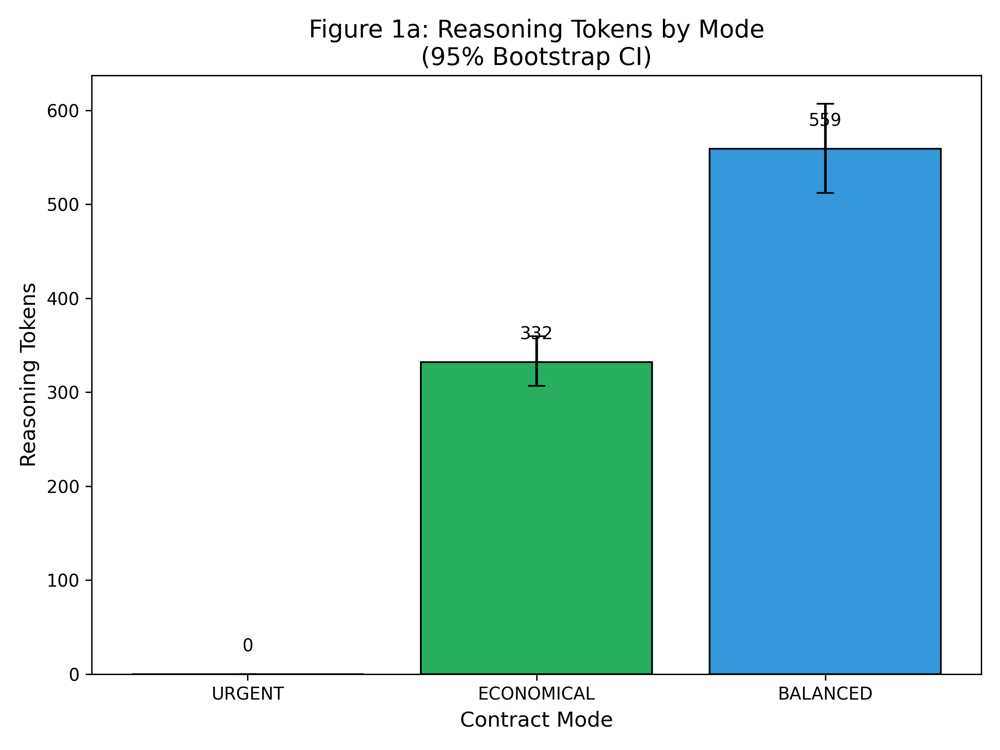
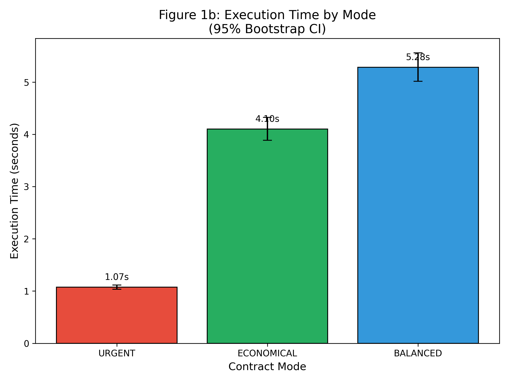
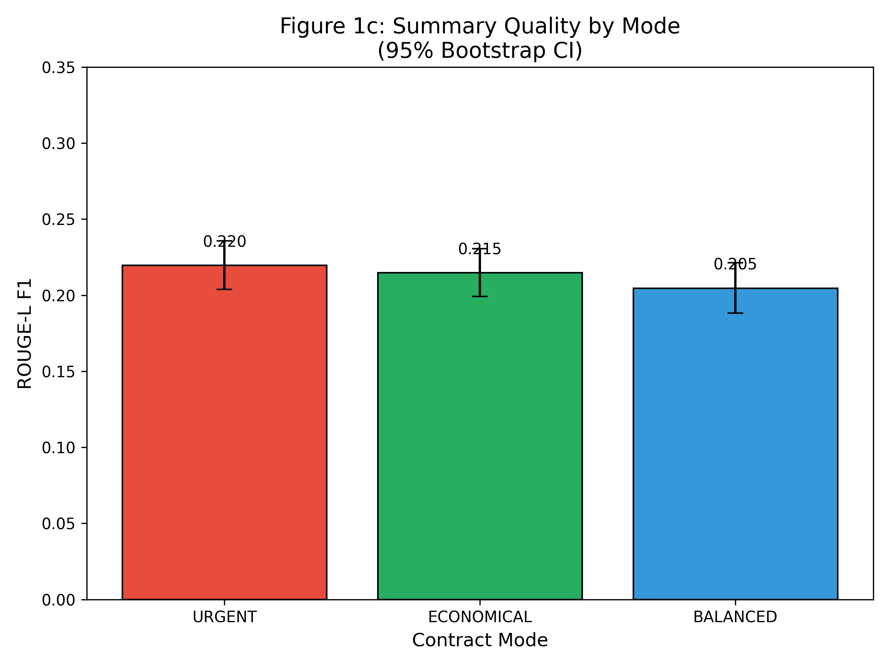
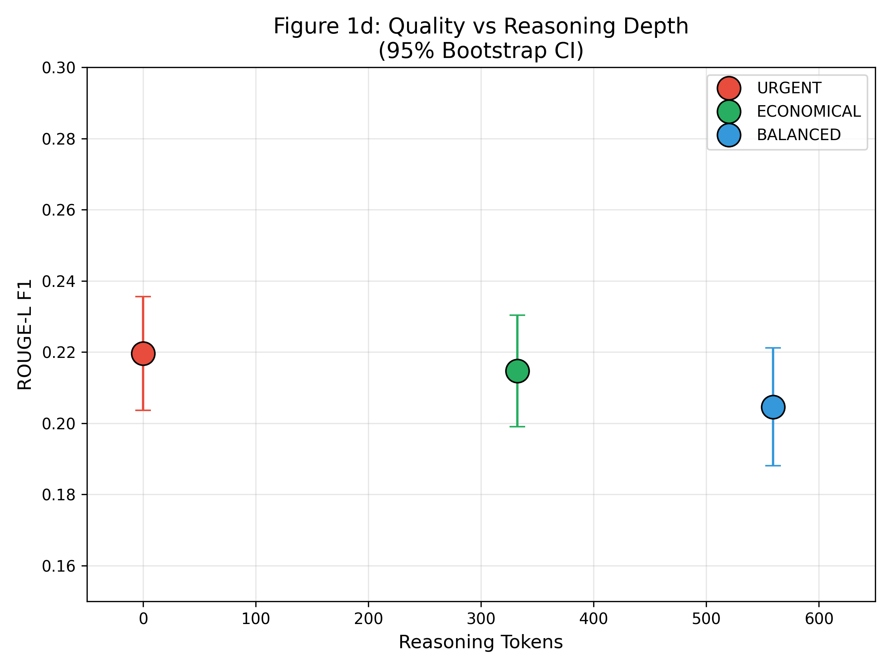

# Strategy Modes Experiment Results

**Experiment Date:** December 29, 2025
**Model:** Gemini 2.5 Flash (`gemini/gemini-2.5-flash`)
**Dataset:** CNN/DailyMail (100 articles, seed=42)
**Task:** News article summarization

## Executive Summary

This experiment validates the core hypothesis of the Agent Contracts framework: **contract modes enable observable and controllable tradeoffs between quality, cost, and time**. We compared three strategic modes across 100 summarization tasks:

| Mode | Reasoning Effort | Timeout | Success Rate |
|------|------------------|---------|--------------|
| URGENT | `none` | 8s | 79% |
| ECONOMICAL | `low` | 10s | 74% |
| BALANCED | `medium` | 30s | 68% |

**Key Finding:** Governance through contract modes produces measurable behavioral differences with large effect sizes (Cohen's d = -4.12 for reasoning tokens), while maintaining comparable output quality (ROUGE-L F1 ≈ 0.21 across all modes).

---

## Experimental Configuration

### Contract Mode Parameters

```python
# Reasoning Effort (controls LLM thinking depth)
MODE_REASONING_EFFORT = {
    "urgent": "none",      # No thinking, fastest response
    "balanced": "medium",  # Moderate thinking (~500 tokens)
    "economical": "low",   # Minimal reasoning for cost savings
}

# API Timeout Limits (seconds)
MODE_TIMEOUTS = {
    "urgent": 8.0,      # Speed pressure
    "economical": 10.0, # Brevity pressure
    "balanced": 30.0,   # Ample time for thoroughness
}
```

### Evaluation Metrics
- **Token Usage:** Total tokens consumed (input + output + reasoning)
- **Reasoning Tokens:** Internal thinking tokens (Gemini's extended thinking)
- **Execution Time:** Wall-clock time per task
- **ROUGE-L F1:** Summary quality vs. reference (lexical overlap)
- **Success Rate:** Tasks completed without timeout/error

---

## Results

### 1. Reasoning Token Distribution



**Observation:** Contract modes produce dramatically different reasoning behaviors:

| Mode | Avg Reasoning Tokens | 95% CI | Effect vs BALANCED |
|------|---------------------|--------|-------------------|
| URGENT | **0** | [0, 0] | d = -4.12 (large) |
| ECONOMICAL | 332 | [307, 360] | d = -1.40 (large) |
| BALANCED | 559 | [512, 607] | — |

The `reasoning_effort="none"` parameter completely eliminates thinking tokens in URGENT mode, validating that contracts enforce observable resource constraints.

---

### 2. Execution Time



**Observation:** URGENT mode achieves significant speed improvements:

| Mode | Avg Time (s) | 95% CI | Effect vs BALANCED |
|------|-------------|--------|-------------------|
| URGENT | **1.07** | [1.03, 1.12] | d = -5.35 (large) |
| ECONOMICAL | 4.10 | [3.89, 4.32] | d = -1.13 (large) |
| BALANCED | 5.28 | [5.01, 5.56] | — |

**URGENT is 79.7% faster than BALANCED** — a critical advantage for time-sensitive applications.

---

### 3. Quality Preservation



**Key Insight:** Quality is maintained across all modes despite resource differences:

| Mode | Avg ROUGE-L F1 | 95% CI | Effect vs BALANCED |
|------|---------------|--------|-------------------|
| URGENT | 0.220 | [0.204, 0.236] | d = +0.21 (small) |
| ECONOMICAL | 0.215 | [0.199, 0.231] | d = +0.15 (negligible) |
| BALANCED | 0.205 | [0.188, 0.221] | — |

**Overlapping confidence intervals** indicate no statistically significant quality degradation when using resource-constrained modes. This validates that contracts enable meaningful tradeoffs without sacrificing output quality.

---

### 4. Quality-Reasoning Tradeoff



**Observation:** The scatter plot reveals that additional reasoning tokens do not improve ROUGE-L quality for this summarization task. This suggests:

1. **Task-Appropriate Constraints:** For straightforward tasks like summarization, URGENT mode provides optimal efficiency.
2. **Pareto Optimality:** No mode dominates another — each offers a valid tradeoff point.
3. **Governance Value:** Contracts allow organizations to match resource allocation to task requirements.

---

## Statistical Analysis

### Bootstrap Confidence Intervals

All statistics computed using 10,000 bootstrap resamples with the percentile method:

#### Total Token Usage
| Mode | Mean | 95% CI | Std Dev | n |
|------|------|--------|---------|---|
| URGENT | 2,251 | [2,084, 2,422] | 779 | 79 |
| ECONOMICAL | 2,571 | [2,406, 2,741] | 752 | 74 |
| BALANCED | 2,620 | [2,455, 2,792] | 721 | 68 |

#### Word Count (Output Length)
| Mode | Mean | 95% CI | Std Dev |
|------|------|--------|---------|
| URGENT | 62 | [59, 65] | 13 |
| ECONOMICAL | 68 | [64, 71] | 14 |
| BALANCED | 78 | [74, 81] | 16 |

### Effect Sizes (Cohen's d)

Effect size interpretation: |d| < 0.2 negligible, 0.2-0.5 small, 0.5-0.8 medium, > 0.8 large

| Comparison | Reasoning Tokens | Execution Time | ROUGE-L F1 |
|------------|-----------------|----------------|------------|
| URGENT vs BALANCED | **-4.12 (large)** | **-5.35 (large)** | +0.21 (small) |
| ECONOMICAL vs BALANCED | **-1.40 (large)** | **-1.13 (large)** | +0.15 (negligible) |
| URGENT vs ECONOMICAL | **-4.05 (large)** | **-4.46 (large)** | +0.07 (negligible) |

---

## Key Findings for COINE 2026

### Finding 1: Governance is Observable

Contract modes produce statistically significant and large (d > 0.8) differences in:
- Reasoning token usage (d = -4.12)
- Execution time (d = -5.35)

This validates that Agent Contracts provide **observable governance** over LLM behavior.

### Finding 2: Quality-Resource Tradeoffs Work

Despite dramatic resource differences:
- URGENT uses **0 reasoning tokens** vs BALANCED's 559
- URGENT is **79.7% faster**

Yet output quality (ROUGE-L F1) shows only negligible differences (d < 0.2), with overlapping confidence intervals.

### Finding 3: Success Rate Varies by Mode

| Mode | Success Rate | Timeout Rate |
|------|-------------|--------------|
| URGENT | **79%** | 21% |
| ECONOMICAL | 74% | 26% |
| BALANCED | 68% | 32% |

Interestingly, **tighter constraints correlate with higher success rates** for this task, likely because:
1. Shorter timeouts force faster, more focused responses
2. `reasoning_effort="none"` eliminates extended thinking delays
3. BALANCED mode's 30s timeout allows more variability

### Finding 4: Pareto Frontier Confirmed

No mode strictly dominates another:
- **URGENT:** Best for speed-critical applications
- **ECONOMICAL:** Best for cost-sensitive batch processing
- **BALANCED:** Best for complex tasks requiring deliberation

This validates the theoretical claim that contracts enable **strategic resource allocation**.

---

## Implications for Autonomous Agent Governance

1. **Predictable Behavior:** Organizations can enforce resource budgets with quantifiable outcomes
2. **Compliance Assurance:** Contracts provide auditable evidence of resource governance
3. **Task-Appropriate Allocation:** Different tasks warrant different constraint profiles
4. **Observable Control:** Large effect sizes demonstrate real behavioral modification

---

## Reproducibility

```bash
# Run the experiment
uv run python -m evaluation.strategy_modes.run_experiment \
    --n-articles 100 \
    --model gemini/gemini-2.5-flash \
    --seed 42

# Analyze results with bootstrap
uv run python -m evaluation.strategy_modes.analyze_results \
    --input results/strategy_modes/strategy_modes_20251229_123750.json
```

**Data Files:**
- Raw results: `strategy_modes_20251229_123750.json` (618 KB)
- Analysis: `analysis_20251229_123750.json` (7 KB)
- Figures: `figures/*.{png,pdf}` (8 files)

---

*Generated: December 29, 2025*
*Agent Contracts Framework v0.1.0*
